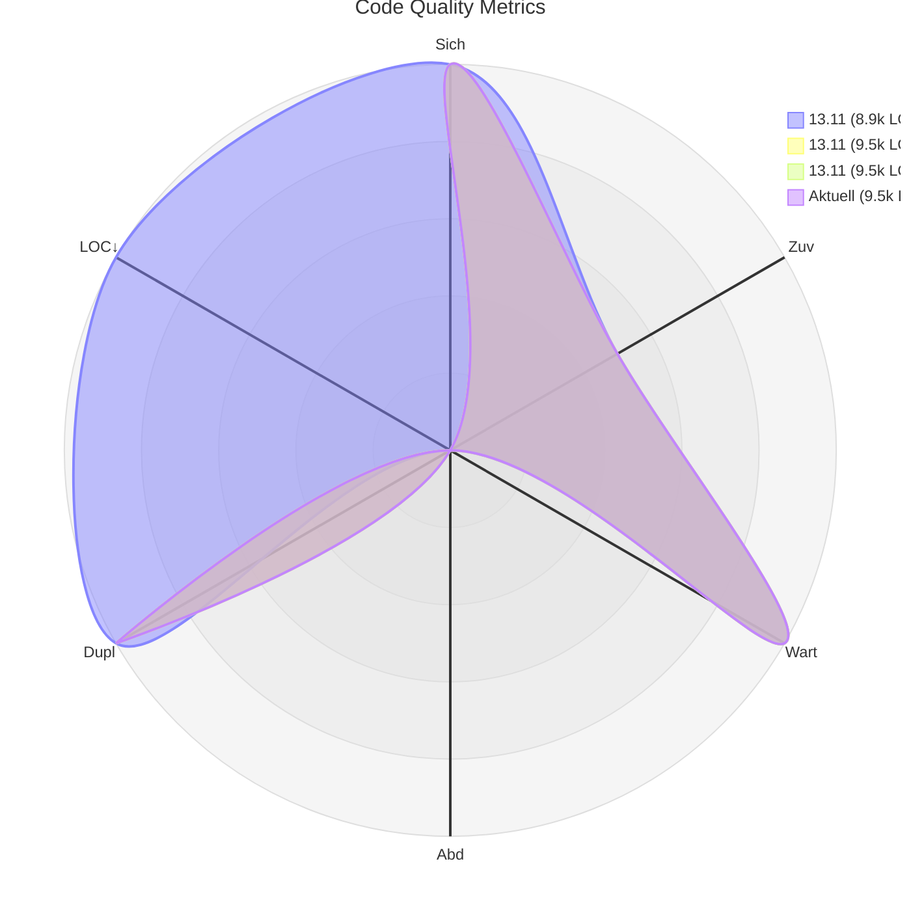

# Code Quality Report

## Quality Metrics Radar

## Current Metrics

| Metrik | Aktueller Wert | Bewertung |
|--------|----------------|-----------|
| Security Rating | 1.0 | 🟩 |
| Reliability Rating | 3.0 | 🟨 |
| Maintainability Rating | 1.0 | 🟩 |
| Coverage | 24.0% | 🟥 |
| Code Duplication | 1.2% | 🟩 |
| Lines of Code | 9528 | 🟥 |

## SonarCloud Badges

Generated on: 2025-11-13T15:09:21.987Z

> Fenster: offset=1, count=3. LOC relativ: min=8855 → 5, max=9528 → 1. Labels: dd.mm (deutsch) + kurze LOC (k).